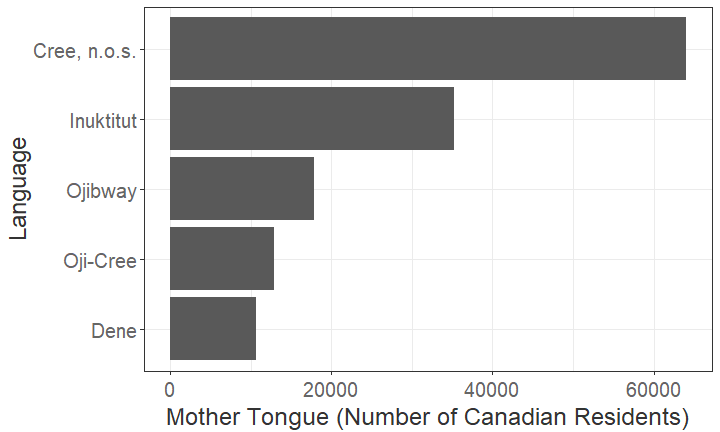
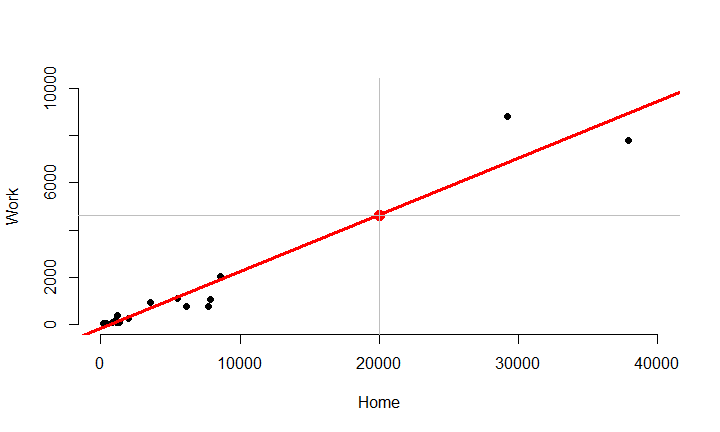

## Introduction


The data set is related to languages spoken by Canadian residents and collected 
during the 2016 Canadian census. The data can be downloaded from [this link](https://raw.githubusercontent.com/UBC-DSCI/introduction-to-datascience/master/data/can_lang.csv).  


```r
can_lang = read_csv(file = fileUrl)
dim(can_lang)
```


```
[1] 214   6
```

There are 214 languages, each of which has 6 properties: (1) `category`, (2) `language`, (3) `mother_tongue`, (4) `most_at_home`, (5) `most_at_work`, (6) `lang_known`  

The application is used to answer 2 questions


## Question 1

#### What are the top 3-10 languages of the selected category spoken most as mother tongue?

<div class="figure" style="text-align: center">

<p class="caption">Top 3 Aboriginal Languages spoken as Mother Tongue</p>
</div>


## Question 2

#### What is the number of people speaking a language at work, given the number of them speaking it at home?  


```r
# Extract only top 20 Aboriginal languages spoken as mother tongue
top20_abo_lang = slice(arranged_abo_lang, 1:20)
# Build model
mdl_abo = lm(most_at_work ~ most_at_home, data = top20_abo_lang)
# Predict most_at_work value from most_at_home value of 20000
homeNew = 20000
workNew_abo = predict(mdl_abo, newdata = data.frame(most_at_home = homeNew))
# Create scatter plot and add linear line and predicted point 
with(top20_abo_lang, plot(x = most_at_home, y = most_at_work,
                          xlab = 'Home', ylab = 'Work',
                          xlim = c(0, 40000), ylim = c(0, 10000),
                          bty = 'n', pch = 16))
abline(mdl_abo, lwd = 3, col = 'red')
points(homeNew, workNew_abo, cex = 1.5, pch = 16, col = 'red')
```

## Question 2



The predicted value of `most_at_work` is 4636 when `most_at_home` is 20000


